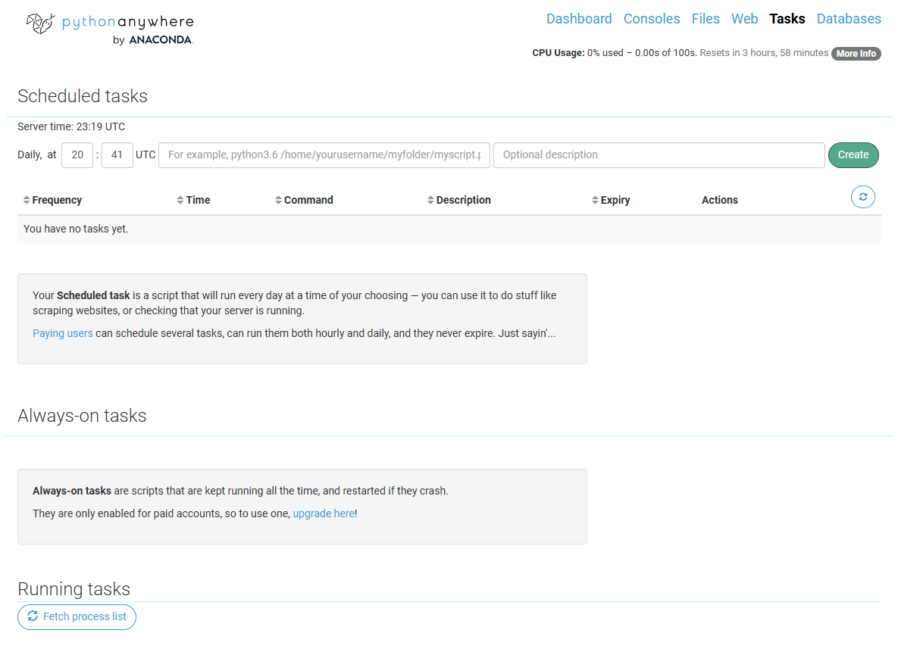

# News to email - API

Python script with a daily schedule in mind. The user will receive news from a specific country and topic via newsapi.org, which is gathered by the robot and sent to their Gmail account.

### How to use?

To add environmental variables, just add a ".env" file to the project directory and add the following:

* email = {*email sender*}
* receiver = {*email receiver*}
* pass = {*email sender app password*}
* api_key = {*newsapi.org api key*}

### How to set up?

As python anywhere is simple to set up and allows one scheduled task on the free tier, I advise setting it up there. Simply sign up, upload the project, and add it to the "Scheduled tasks" page.

See [https://help.pythonanywhere.com/pages/ScheduledTasks]() for more details.

